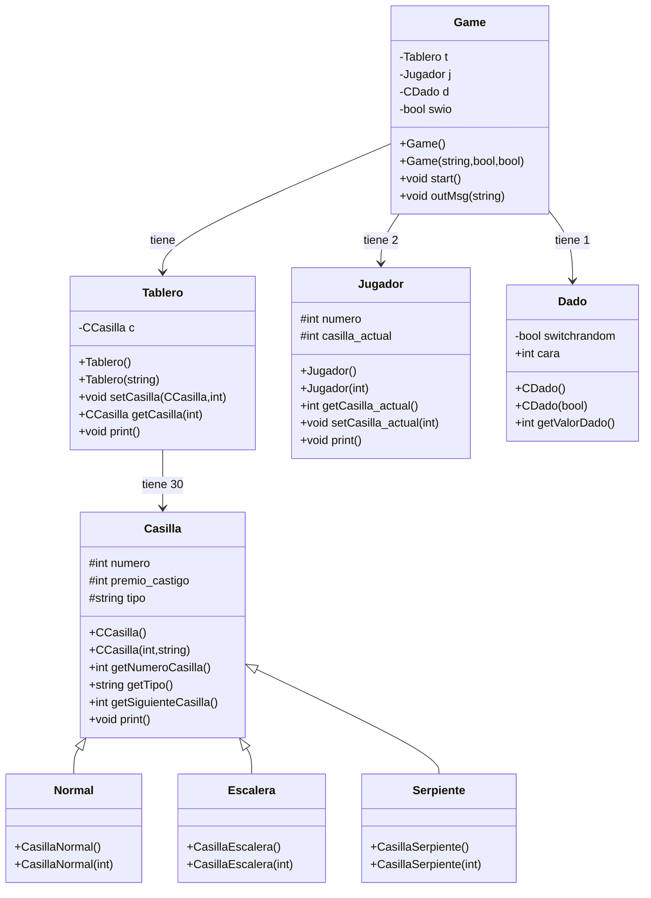

# Finally Fantastic - Python RPG

### To run this project you should do the following commands

```shell
venv\bin\activate
```
```shell
pip install -r requirements.txt
```

## This project uses the following Design Patterns:

- Creational Pattern: 
- Structural Pattern:
- Comportamiento Pattern: 
- Extra Pattern (Type): 

## UML created in mermaid:


