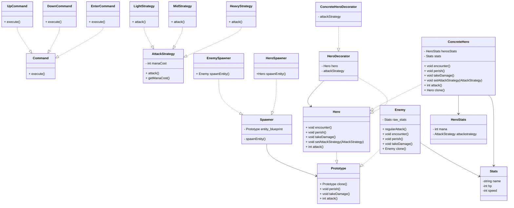

# Finally Fantastic - Python RPG (NOT YET FINISHED)

### To run this project you should do the following commands
```shell
python -m venv venv
```
```shell
venv/Scripts/activate
```
```shell
pip install -r requirements.txt
```
```shell
python main.py
```

## This project uses the following Design Patterns:

- Creational Pattern: **Prototype**
- Structural Pattern: **Decorator**
- Behavioral Pattern: **Strategy**
- Extra Pattern (Behavioral): **Command**

## Justification:
### **Problem solved by pattern, Reasoning and How it solved it**
- Prototype: I needed to create copies of enemies and In the future I wanted to add a duplicating party just for fun. Prototype Allowed me to create multiple copies of one object, and since we can use deep I can later change all of the shallow copies names to something simple but enumerated. Its easy to use and scale for future implementations

- Decorator: I wanted to implement RPG classes, like healer or mage or tank. Decorator in my opinion was the best pattern for the job. While retaining their atributes from the abstract class Hero, I could make version of a Hero that had aditives, like modifying the attack function from one place. However i didnt actually want to modify the attack solely by using Decorator the next desifgn pattern allowed the basic behaviour of an attack. With Decorator I could add the differences between each hero and it also allowed me to create more classes for my game in the future.

- Strategy: This was a must, polymorfism is tied to game-developing. I wanted the player to select attacks, but i also did not want to code a hundred attacks and use composition and other things... Strategy enabled me to create Three Behaviours for the attack method of a hero but it also allowed me to interchange between those options. I can also create more behaviours and make them more complicated if I want to and at the same time am not messing with the functionalities as my Class Hero.

- Command: Also tied to game-developing, I need a standard so that the player could play no matter what control scheme they decided to use. Command allowed my code to be even more modular and easy to use. I had some trouble implementing Command like *I* wanted to, it had to do with the stack am using to read keyboard inputs. Nonetheless, Command did in fact help me and will help me more when i implement it correctly. Command solved the following, I have to controller schemes, either use Arro keys or W and S keys to choose options in the menu. I only had to code one controller that worked for both schemes.

## UML created in mermaid:

