# Finally Fantastic - Python RPG

### To run this project you should do the following commands

```shell
venv/Scripts/activate
```
```shell
pip install -r requirements.txt
```
```shell
python main.py
```

## This project uses the following Design Patterns:

- Creational Pattern: **Prototype**
- Structural Pattern: **Decorator**
- Behavioral Pattern: **Strategy**
- Extra Pattern (Behavioral): **Command**

## UML created in mermaid:

```mermaid
classDiagram
    class Command {
        + execute()
    }

    class UpCommand {
        + execute()
    }

    class DownCommand {
        + execute()
    }
    
    class SelectCommand {
        + execute()
    }

    class Prototype {
	    +Prototype clone()
    }

    class Hero {
        - int mana
	    - AttackStrategy attackStrategy
        - void setAttackStrategy(AttackStrategy)
    }

    class AttackStrategy {
	    + attack()
    }

    class LightStrategy {
	    + attack()
    }

    class MidStrategy {
	    + attack()
    }

    class HeavyStrategy {
	    + attack()
    }

    class ConcreteHero {
	    - Stats raw_stats
	    - attackStrategy
	    + Hero clone()
    }

    class HeroDecorator {
	    - Hero hero
	    - attackStrategy
    }

    class ConcreteHeroDecorator {
	    - attackStrategy
    }

    class Enemy {
	    - Stats raw_stats
	    + regularAttack()
	    + Enemy clone()
    }

    class Spawner {
	    - Prototype entity_blueprint
	    - spawnEntity()
    }

    class EnemySpawner {
	    + Enemy spawnEntity()
    }

    class HeroSpawner {
	    +Hero spawnEntity()
    }

    class Stats {
	    -string name
	    -int hp
	    -int speed
    }

    %% Composición
    HeroDecorator --> Hero
    Hero --> Stats
    Enemy --> Stats
    Spawner --> Prototype
    Hero --> AttackStrategy

    %% Herencia
    UpCommand ..|> Command
    DownCommand ..|> Command
    SelectCommand ..|> Command
    LightStrategy ..|> AttackStrategy
    MidStrategy ..|> AttackStrategy
    HeavyStrategy ..|> AttackStrategy
    ConcreteHero ..|> Hero
    HeroDecorator ..|> Hero
    Hero ..|> Prototype
    ConcreteHeroDecorator ..|> HeroDecorator
    Enemy ..|> Prototype
    EnemySpawner ..|> Spawner
    HeroSpawner ..|> Spawner
```

